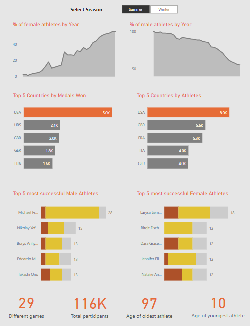

# About
This project analyses historical dataset on modern Olympic games, from 1896 to 2016. Find the dataset [here](https://www.kaggle.com/datasets/heesoo37/120-years-of-olympic-history-athletes-and-results).

### SQL
`queries.sql` answer the 20 following questions:
1. How many Olympic games have taken place?
2. List all the Olympic games along with the cities where they were held.
3. List every region that took part in the 1896 Summer Games.
4. Mention the total number of countries that competed in each Olympic game.
5. Which Olympic game has the most and least countries participating?
6. Which nation or country has competed in each and every Olympic Game?
7. Get the top 5 medal-winning nations from the Olympics. Success is measured by the total number of medals earned.
8. How many gold, silver, and bronze medals did each nation win in total?
9. List all of Nigeria’s gold, silver, and bronze medals from each Olympic game.
10. List the total number of gold, silver, and bronze medals each nation has earned at each Olympic game.
11. Which country has never won a gold medal but has instead received a silver or bronze?
12. Which countries never won a single medal?
13. Mention the total no of nations who participated in each olympics game?
14. Which nation has participated in all of the olympic games?
15. Which year saw the highest and lowest no of countries participating in olympics?
16. Fetch the total no of sports played in each olympic games.
17. Fetch details of the oldest athletes to win a gold medal.
18. Find the Ratio of male and female athletes participated in all olympic games.
19. Fetch the top 5 athletes who have won the most gold medals.
20. Fetch the top 5 athletes who have won the most medals.

### PowerBI
`olympics.pbix` provides a report created in PowerBI

